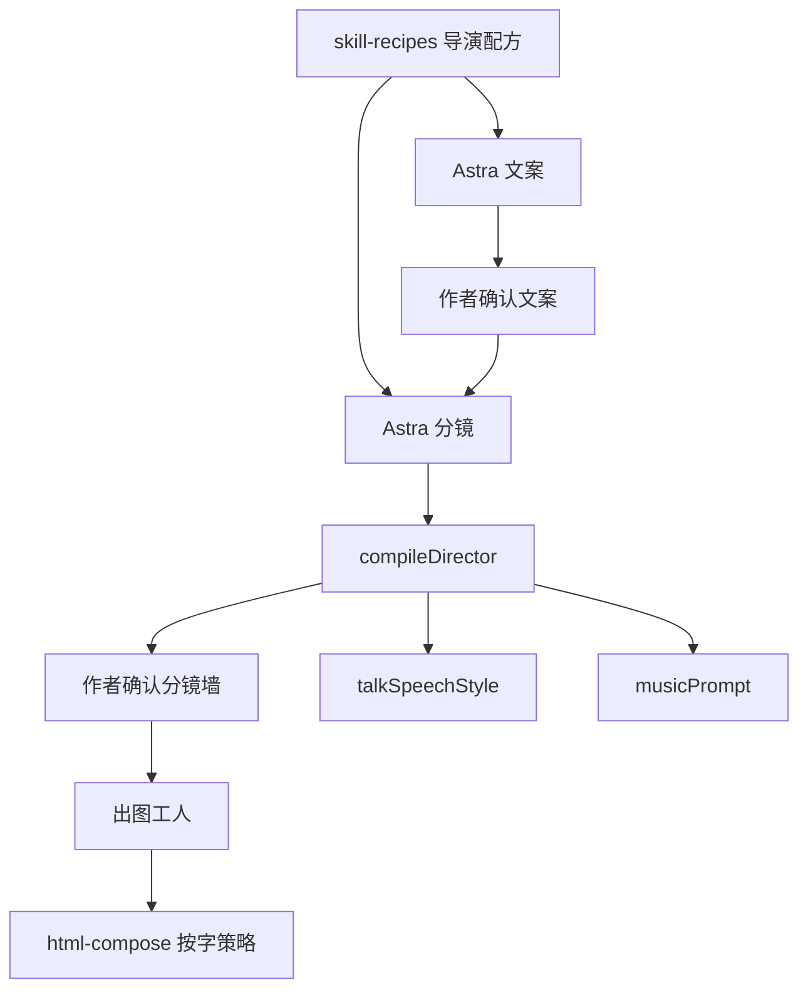

# Implementation Plan: 分镜总导演

**Branch**: `feature/019-registry-compose` | **Date**: 2026-09-10 | **Spec**: [spec.md](./spec.md)

## Approach

一个导演心智，两口 Astra，一个编译器。不拆 Agent。



1. 扩展 `src/lib/skill-recipes.ts`：`boardDirector`（全片节奏）、`intentLooks`（每个中文动作一句竖屏效果）、`letteringLaw`、`voiceRoles`、`musicBeats`。
2. `buildCopySystem` 追加垫乐意图；`buildBoardSystem` 改成先全片后每镜，动作带「长什么样」，字策略/语速角色进 JSON。
3. 新模块 `src/lib/director-compile.ts`：`compileDirector(script, aspect)`，在 `applyBoard` / `planHouseGraphics` 之后调用。
4. `talkSpeechStyle` 读 `voiceRole`；`planShotLettering` / `stillBakesLettering` 读字策略。
5. 分镜墙 `shotLayoutLine` 追加中文字策略。无新路由、无选技能。

竖屏知识「图表」→ `划重点`（叠人）或 `流程图`（整屏、无人），禁止 `data-chart`。

## Mobbin（UI 必填）

- 参考产品 / 模式：剪映图文成片的分镜卡片（场景 + 花字/贴图标签，作者不选插件 id）
- 链接或检索关键词：CapCut auto captions one style per scene；剪映 图文成片 分镜
- 缺口：我们多一层「字策略」中文，仍不出现工作流名

## Env / Dependencies

```
SCRIPT_MODEL=gpt-6-astra
# 不新增 Agent 服务、不读 SKILL.md
```

## Test Plan

- Unit: `director-compile.test.ts`、配方提示、语速角色、字策略与合成
- API: 知识 9:16 确认分镜后无 `data-chart`，组法种类、字策略字段存在
- Browser: 知识口播确认文案→分镜，墙上中文组法/字策略，中段不是横版报表
